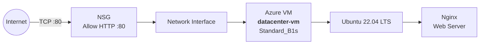
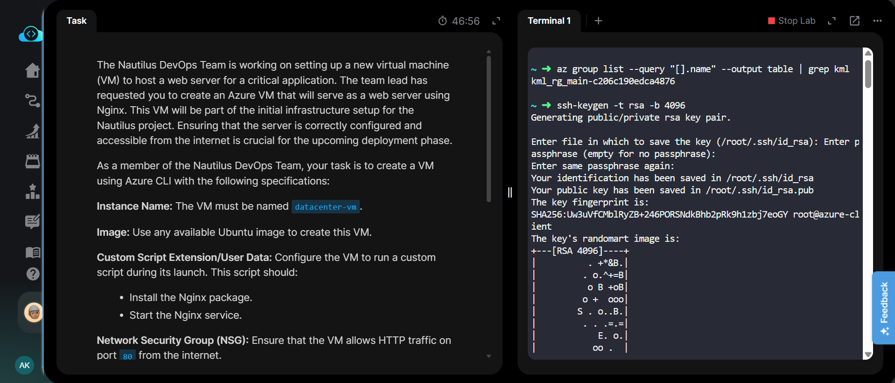
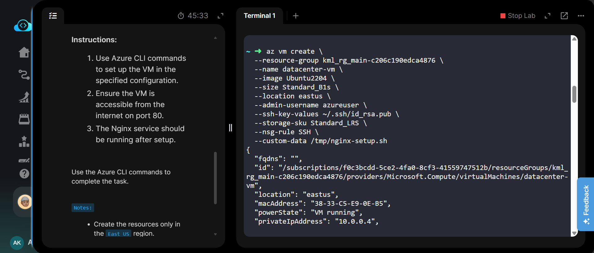
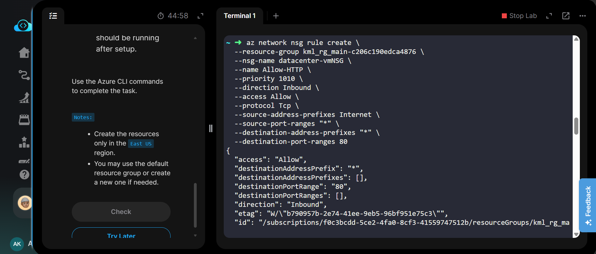
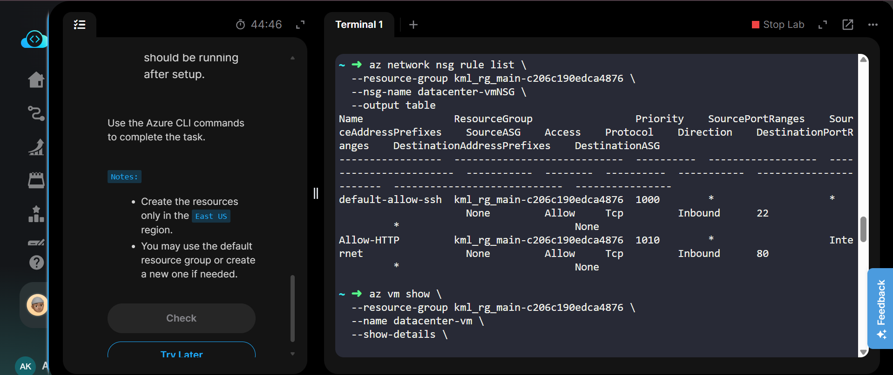
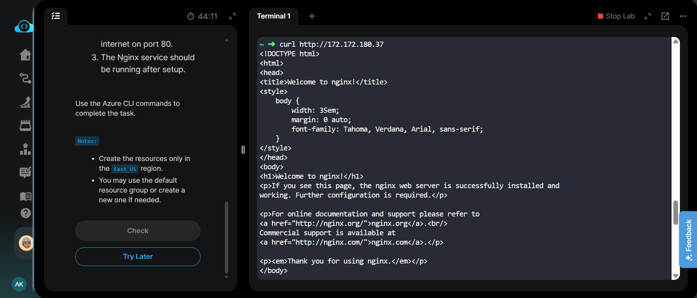
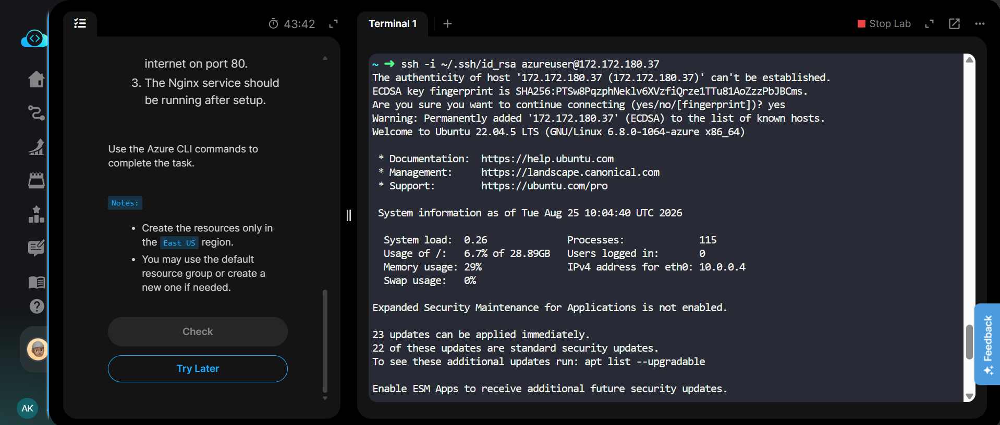
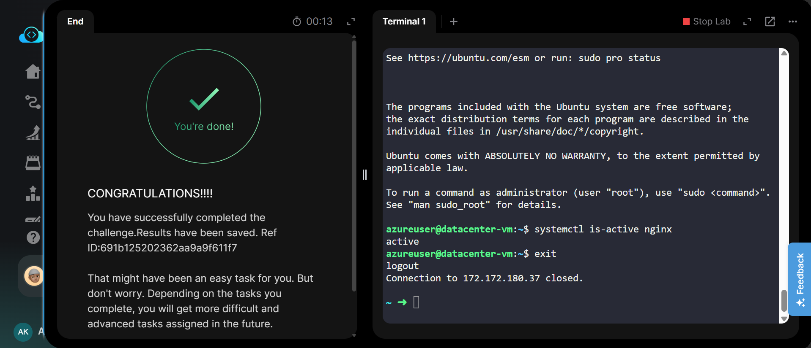

# Azure CLI - Create Ubuntu VM with Nginx Web Server

[](https://azure.microsoft.com/)
[](https://ubuntu.com/)
[](https://nginx.org/)
[](https://learn.microsoft.com/cli/azure/)

## Project Information

| Field | Details |
|---|---|
| **Project Name** | Create Ubuntu VM with Nginx Web Server |
| **Task Number** | 23 |
| **Cloud Platform** | Microsoft Azure |
| **Category** | Virtual Machines / Web Server |
| **Primary Services** | Azure Virtual Machine, Network Security Group, Public IP, Nginx |
| **VM Name** | `datacenter-vm` |
| **Image** | Ubuntu 22.04 LTS |
| **VM Size** | `Standard_B1s` |
| **OS Disk** | Standard HDD LRS (`Standard_LRS`) |
| **Region** | East US |
| **Admin Username** | `azureuser` |
| **Web Server** | Nginx |
| **HTTP Port** | `80` |
| **Implementation** | Azure CLI |

## Overview

This lab demonstrates how to create and configure an Azure Virtual Machine using Azure CLI.

The VM is configured with Ubuntu 22.04, the `Standard_B1s` VM size, and a Standard HDD LRS OS disk. A custom startup script is used to install and start the Nginx web server automatically.

A Network Security Group rule is also configured to allow inbound HTTP traffic on port `80` from the internet, making the Nginx web server accessible externally.

## Objective

The objective of this task is to:

- Create an Azure VM named `datacenter-vm`.
- Use an available Ubuntu image.
- Use the `Standard_B1s` VM size.
- Use Standard HDD LRS storage.
- Deploy the VM in the East US region.
- Generate and use an SSH key pair for secure access.
- Configure Nginx using custom user data.
- Start the Nginx service automatically.
- Allow HTTP traffic on port `80`.
- Verify that Nginx is accessible from the internet.
- Verify that the Nginx service is running.

## Skills Demonstrated

- Azure CLI
- Azure Virtual Machine deployment
- Linux VM administration
- SSH key-based authentication
- Azure Network Security Groups
- NSG inbound security rules
- HTTP networking
- Custom VM user data
- Bash scripting
- Nginx installation and configuration
- Service management with `systemctl`
- VM and network troubleshooting

## Services Used

- **Azure Virtual Machines**
- **Azure Network Security Group**
- **Azure Public IP**
- **Azure Virtual Network**
- **Ubuntu 22.04 LTS**
- **Nginx**
- **Azure CLI**

## Architecture Diagram



## Steps Performed

### 1. Identified the Resource Group

The available KodeKloud resource group was identified using Azure CLI.

```bash
az group list --query "[].name" --output table | grep kml
```

Resource Group:

```text
kml_rg_main-c206c190edca4876
```

### 2. Generated SSH Key Pair

An RSA 4096-bit SSH key pair was generated on the Azure client host.

```bash
ssh-keygen -t rsa -b 4096
```

The generated public key was verified using:

```bash
cat ~/.ssh/id_rsa.pub
```

The public key was associated with the Azure VM during VM creation.

### 3. Created the Nginx Startup Script

A custom startup script was created to install Nginx and start the Nginx service.

The script performs:

```bash
#!/bin/bash
apt-get update
apt-get install -y nginx
systemctl enable nginx
systemctl start nginx
```

The script was supplied to the VM through the `--custom-data` option.

### 4. Created the Azure Virtual Machine

The VM was created using Azure CLI with:

- Name: `datacenter-vm`
- Image: Ubuntu 22.04
- Size: `Standard_B1s`
- Region: East US
- Storage: `Standard_LRS`
- SSH key authentication
- Custom Nginx startup script

### 5. Configured HTTP Access

The VM's Network Security Group was configured with an inbound rule allowing TCP traffic on port `80` from the internet.

Rule:

```text
Name: Allow-HTTP
Protocol: TCP
Direction: Inbound
Access: Allow
Source: Internet
Destination Port: 80
```

### 6. Verified the Network Security Group

The NSG rules were listed and verified using Azure CLI.

The `Allow-HTTP` rule was present with destination port `80`.

### 7. Retrieved the VM Public IP

The public IP address of the VM was retrieved using Azure CLI.

The obtained public IP was:

```text
172.172.180.37
```

### 8. Verified Nginx over HTTP

The Nginx web server was tested from the Azure client host using:

```bash
curl http://172.172.180.37
```

The default Nginx HTML response was returned successfully, confirming that:

- Nginx was installed.
- Nginx was running.
- HTTP port `80` was accessible.
- The VM was reachable from the internet.

### 9. Verified SSH Connectivity

SSH access to the VM was tested using the generated private key:

```bash
ssh -i ~/.ssh/id_rsa azureuser@172.172.180.37
```

The connection was successful.

### 10. Verified Nginx Service

After connecting to the VM, the Nginx service status was checked:

```bash
systemctl is-active nginx
```

Output:

```text
active
```

This confirmed that the Nginx service was running successfully.

## Commands Used

The complete Azure CLI command sequence used for this lab is documented here:

[**Commands/commands.md**](Commands/commands.md)

The commands file contains the complete implementation, verification, SSH connectivity, Nginx validation, and NSG configuration commands.

## Troubleshooting

### HTTP Access Not Working

If the Nginx page is not accessible through port `80`, verify the NSG rules:

```bash
az network nsg rule list \
  --resource-group kml_rg_main-c206c190edca4876 \
  --nsg-name datacenter-vmNSG \
  --output table
```

Ensure that an inbound rule exists allowing TCP port `80`.

### Nginx Service Not Running

Connect to the VM:

```bash
ssh -i ~/.ssh/id_rsa azureuser@<PUBLIC_IP>
```

Check the service:

```bash
systemctl status nginx
```

Start it manually if required:

```bash
sudo systemctl start nginx
```

Enable it at boot:

```bash
sudo systemctl enable nginx
```

### Verify Nginx Locally

Inside the VM:

```bash
curl http://localhost
```

If the Nginx HTML page is returned, the web server is working locally.

### SSH Connection Problems

Verify that the VM has a public IP and that the SSH key is correct:

```bash
az vm show \
  --resource-group kml_rg_main-c206c190edca4876 \
  --name datacenter-vm \
  --show-details \
  --output table
```

## Debugging Notes

- The VM was created with an SSH key generated on the Azure client host.
- The public key was supplied using `--ssh-key-values ~/.ssh/id_rsa.pub`.
- The VM was created with the `Standard_B1s` size as required.
- The OS disk used the `Standard_LRS` storage SKU.
- The VM was deployed in the East US region.
- The initial VM creation command included an SSH NSG rule.
- The HTTP rule was added separately because `az vm create --nsg-rule` does not accept `HTTP` as a valid value.
- The HTTP NSG rule was created explicitly using `az network nsg rule create`.
- The Nginx startup script was supplied using the `--custom-data` option.
- Nginx was verified using both HTTP `curl` testing and `systemctl`.

## Best Practices

- Use SSH key authentication instead of password-based authentication.
- Keep private SSH keys secure and never commit them to Git.
- Allow only required network ports through NSG rules.
- Use a dedicated NSG rule for HTTP traffic.
- Use `systemctl enable` to ensure Nginx starts automatically after reboot.
- Verify both application-level connectivity and network-level access.
- Use Azure CLI commands for repeatable infrastructure deployment.
- Use the smallest suitable VM size for lightweight workloads and lab environments.

## Key Learnings

- Azure VMs can be deployed completely using Azure CLI.
- SSH keys provide secure passwordless VM access.
- `--custom-data` can automate software installation during VM provisioning.
- Network Security Groups control inbound and outbound network access.
- HTTP traffic requires TCP port `80` to be allowed through the NSG.
- Nginx can be installed and started automatically using a Bash startup script.
- `curl` is useful for validating web server accessibility.
- `systemctl` can be used to verify Linux service status.
- Azure CLI provides commands for both resource creation and verification.

## Related Concepts

- Azure Virtual Machines
- Azure Networking
- Network Security Groups
- Public IP Addresses
- SSH Authentication
- Linux System Administration
- Cloud Infrastructure
- Infrastructure Automation
- Web Server Deployment
- Nginx
- HTTP / TCP
- VM Bootstrapping
- Azure CLI

## Screenshots

### 01 - Task and SSH Key Generation



### 02 - Create VM



### 03 - Create HTTP NSG Rule



### 04 - Verify NSG and VM



### 05 - Nginx HTTP Verification



### 06 - SSH Connectivity



### 07 - Task Completed



## Result

The Azure VM `datacenter-vm` was successfully created in the **East US** region using Ubuntu 22.04 LTS, `Standard_B1s` VM size, and Standard HDD LRS storage.

The VM was configured with SSH key-based access and a custom startup script that installed and started Nginx.

An NSG inbound rule was configured to allow HTTP traffic on port `80` from the internet.

The Nginx web server was successfully accessed using HTTP, SSH connectivity was verified, and the Nginx service reported an `active` status.

**Task 23 completed successfully.**