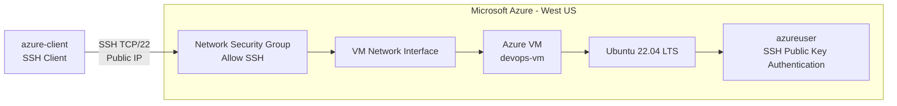
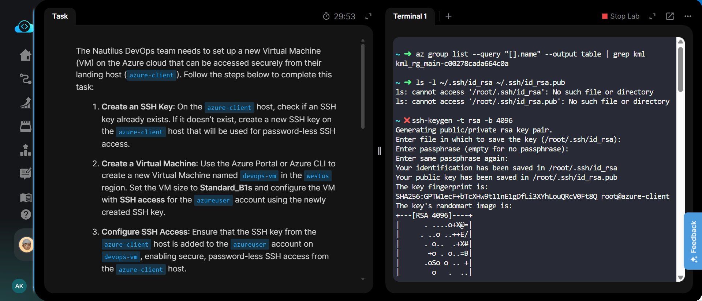
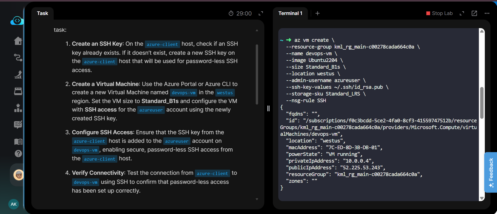
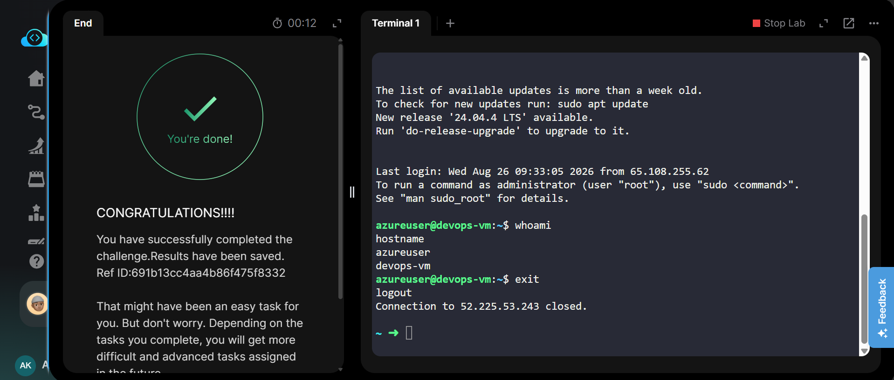

# Azure Virtual Machine - SSH Access

[](https://azure.microsoft.com/)
[](https://learn.microsoft.com/cli/azure/)
[](https://ubuntu.com/)
[]()

---

## Project Information

| Field | Details |
|---|---|
| **Project Name** | Create Azure VM with SSH Access |
| **Task Number** | 24 |
| **Cloud Platform** | Microsoft Azure |
| **Category** | Virtual Machines |
| **Primary Service** | Azure Virtual Machines |
| **Difficulty** | Easy |
| **Region** | West US |
| **VM Name** | `devops-vm` |
| **VM Size** | `Standard_B1s` |
| **Operating System** | Ubuntu 22.04 LTS |
| **Storage SKU** | `Standard_LRS` |
| **Admin Username** | `azureuser` |
| **SSH Access** | SSH Public Key Authentication |
| **Implementation** | Azure CLI |

---

## Overview

This task demonstrates how to create an Azure Virtual Machine using Azure CLI and configure secure, passwordless SSH access from the `azure-client` host.

The VM was created in the **West US** region with the required `Standard_B1s` size and Ubuntu 22.04 LTS image. An RSA 4096-bit SSH key pair was generated on the Azure client host and the public key was associated with the `azureuser` account during VM creation.

After deployment, SSH connectivity was verified successfully from the `azure-client` host.

---

## Objective

The objectives of this task were:

- Check whether an SSH key already exists on the `azure-client` host.
- Generate an RSA 4096-bit SSH key pair if required.
- Create an Azure VM named `devops-vm`.
- Deploy the VM in the `West US` region.
- Use the `Standard_B1s` VM size.
- Use an available Ubuntu image.
- Configure the `azureuser` account for SSH access.
- Associate the generated SSH public key with the VM.
- Enable SSH access through the VM's Network Security Group.
- Verify passwordless SSH connectivity from `azure-client`.

---

## Skills Demonstrated

- Azure CLI
- Azure Virtual Machine deployment
- Linux virtual machine administration
- SSH key generation
- SSH public key authentication
- Azure Network Security Groups
- Azure networking basics
- VM configuration and verification
- Passwordless SSH connectivity
- Azure resource verification

---

## Services Used

- **Azure Virtual Machines**
- **Azure Virtual Network**
- **Azure Network Security Group**
- **Azure Public IP**
- **Azure CLI**
- **Ubuntu 22.04 LTS**

---

## Architecture Diagram



---

## Steps Performed

### 1. Checked for Existing SSH Key

The Azure client host was checked for an existing RSA SSH key:

```bash
ls -l ~/.ssh/id_rsa ~/.ssh/id_rsa.pub
```

The key files were not present, so a new SSH key pair was generated.

---

### 2. Generated RSA SSH Key Pair

A 4096-bit RSA SSH key pair was generated on the `azure-client` host:

```bash
ssh-keygen -t rsa -b 4096
```

The default file location was used:

```text
/root/.ssh/id_rsa
/root/.ssh/id_rsa.pub
```

The key was created without a passphrase to allow passwordless SSH authentication.

---

### 3. Verified the SSH Public Key

The generated public key was displayed using:

```bash
cat ~/.ssh/id_rsa.pub
```

Only the public key was supplied to Azure during VM creation.

---

### 4. Identified the Resource Group

The available lab resource group was identified using:

```bash
az group list --query "[].name" --output table | grep kml
```

Resource group used:

```text
kml_rg_main-c00278cada664c0a
```

---

### 5. Created the Azure Virtual Machine

The VM was created using Azure CLI with the required configuration:

```bash
az vm create \
  --resource-group kml_rg_main-c00278cada664c0a \
  --name devops-vm \
  --image Ubuntu2204 \
  --size Standard_B1s \
  --location westus \
  --admin-username azureuser \
  --ssh-key-values ~/.ssh/id_rsa.pub \
  --storage-sku Standard_LRS \
  --nsg-rule SSH
```

The VM was successfully created with:

- **Name:** `devops-vm`
- **Region:** `West US`
- **Image:** Ubuntu 22.04
- **Size:** `Standard_B1s`
- **Storage:** `Standard_LRS`
- **Username:** `azureuser`
- **SSH:** Enabled
- **Public IP:** `52.225.53.243`

---

### 6. Configured SSH Access

The generated public SSH key was automatically added to the `azureuser` account during VM creation.

The VM's Network Security Group was configured with an SSH rule allowing TCP traffic on port `22`.

---

### 7. Tested SSH Connectivity

The VM was accessed from the `azure-client` host using the generated private key:

```bash
ssh -i ~/.ssh/id_rsa azureuser@52.225.53.243
```

The connection was established successfully without requiring a password.

---

### 8. Verified VM Access

After connecting to the VM, the authenticated user was verified:

```bash
whoami
```

Output:

```text
azureuser
```

The VM hostname was also verified:

```bash
hostname
```

Output:

```text
devops-vm
```

This confirmed that passwordless SSH access was working correctly.

---

## Commands Used

All Azure CLI, SSH, key-generation, and verification commands used for this task are documented here:

[Commands/commands.md](Commands/commands.md)

---

## Troubleshooting

### SSH Key Not Found

If the SSH key does not exist:

```bash
ssh-keygen -t rsa -b 4096
```

Verify the public key:

```bash
cat ~/.ssh/id_rsa.pub
```

---

### SSH Connection Refused

Verify that the VM has an SSH NSG rule:

```bash
az network nsg list \
  --resource-group kml_rg_main-c00278cada664c0a \
  --output table
```

Verify that TCP port `22` is allowed in the NSG.

---

### Permission Denied During SSH

Ensure the correct private key is used:

```bash
ssh -i ~/.ssh/id_rsa azureuser@52.225.53.243
```

Verify private key permissions:

```bash
chmod 600 ~/.ssh/id_rsa
```

---

### VM Status Verification

Check the VM status:

```bash
az vm show \
  --resource-group kml_rg_main-c00278cada664c0a \
  --name devops-vm \
  --show-details \
  --output table
```

---

## Debugging Notes

- The Azure client initially did not contain the required RSA key pair.
- A new RSA 4096-bit key pair was therefore generated.
- The public key was passed to Azure using `--ssh-key-values`.
- The VM was created with the `SSH` NSG rule to allow TCP port `22`.
- SSH connectivity was tested using the generated private key.
- The successful `whoami` and `hostname` outputs confirmed correct authentication and VM connectivity.

---

## Best Practices

- Use SSH public key authentication instead of passwords.
- Never share or commit the private SSH key.
- Store private keys with restrictive permissions.
- Use `chmod 600` for private SSH keys.
- Allow SSH only through required NSG rules.
- Use the smallest suitable VM size for lab workloads.
- Keep VM resources in the intended Azure region.
- Verify VM and network configuration after deployment.

---

## Key Learnings

- How to generate an RSA SSH key pair on an Azure client host.
- How to deploy an Azure VM using Azure CLI.
- How to associate an SSH public key with an Azure VM.
- How Azure NSGs control inbound SSH access.
- How to connect to an Azure Linux VM using SSH.
- How to verify the authenticated Linux user.
- How to verify the hostname of an Azure VM.
- How to configure passwordless SSH access securely.

---

## Related Concepts

- Azure Virtual Machines
- Azure CLI
- Azure Network Security Groups
- Azure Virtual Network
- Public IP Address
- Linux SSH
- RSA Key Authentication
- Passwordless Authentication
- Ubuntu Server
- Cloud Networking
- Infrastructure as Code Concepts

---

## Screenshots

### 01 - SSH Key Generation

Shows the initial SSH key check and generation of the RSA 4096-bit key pair on the `azure-client` host.

[](screenshots/01-ssh-key-generation.png)

---

### 02 - Azure VM Creation

Shows the successful creation of `devops-vm` using Azure CLI with Ubuntu 22.04, `Standard_B1s`, `Standard_LRS`, `West US`, and SSH configuration.

[](screenshots/02-create-vm.png)

---

### 03 - SSH Connectivity Verification

Shows the successful SSH connection to `devops-vm`, including:

- `whoami` → `azureuser`
- `hostname` → `devops-vm`
- Successful SSH session termination

[](screenshots/03-ssh-verification.png)

---

## Result

The Azure Virtual Machine **`devops-vm`** was successfully created in the **West US** region using:

- **Ubuntu 22.04 LTS**
- **Standard_B1s**
- **Standard_LRS**
- **azureuser** administrator account
- **RSA 4096-bit SSH key authentication**
- **SSH TCP port 22**
- **Public IP:** `52.225.53.243`

Passwordless SSH connectivity from the `azure-client` host was successfully verified.

```text
azureuser@devops-vm:~$ whoami
azureuser

azureuser@devops-vm:~$ hostname
devops-vm
```

**Task completed successfully.**