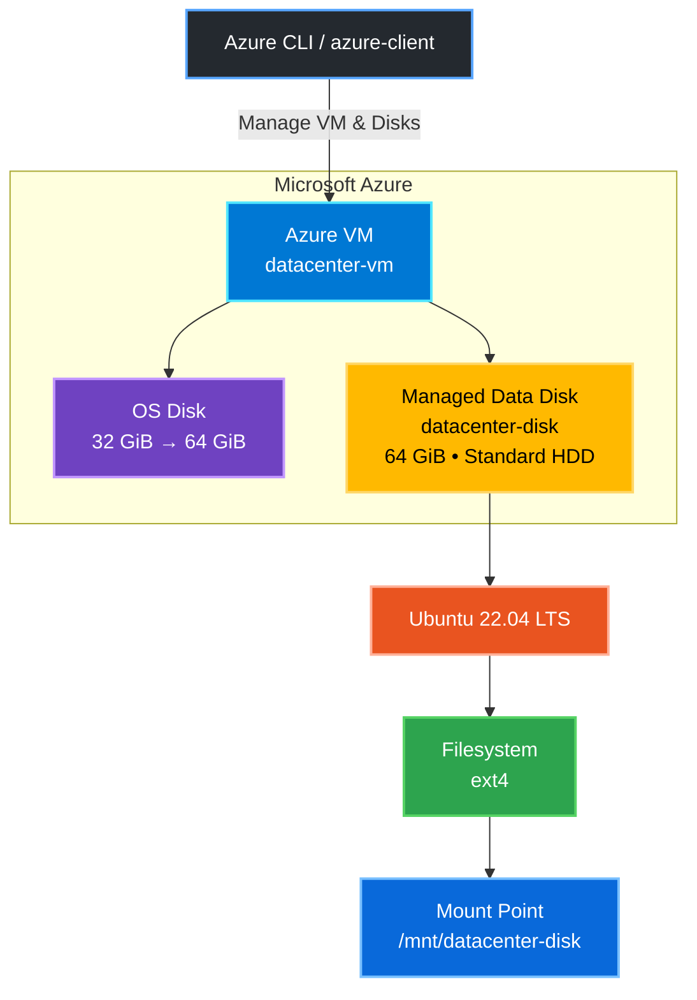
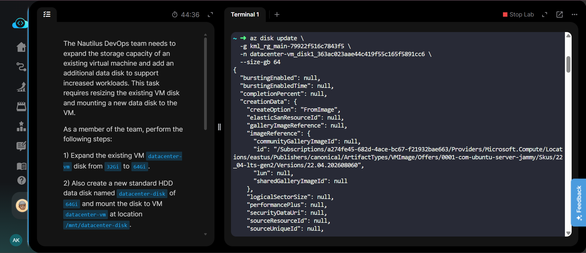
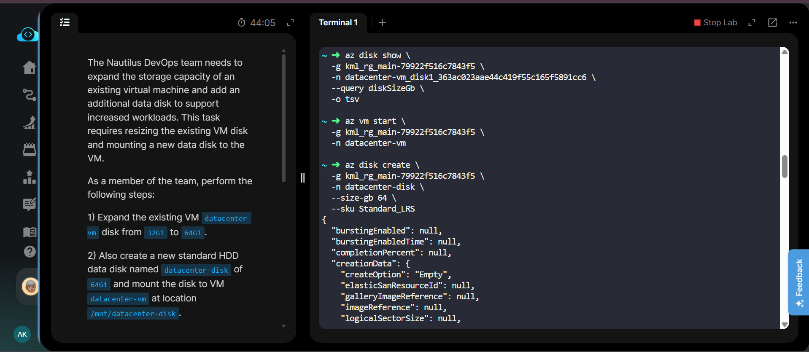
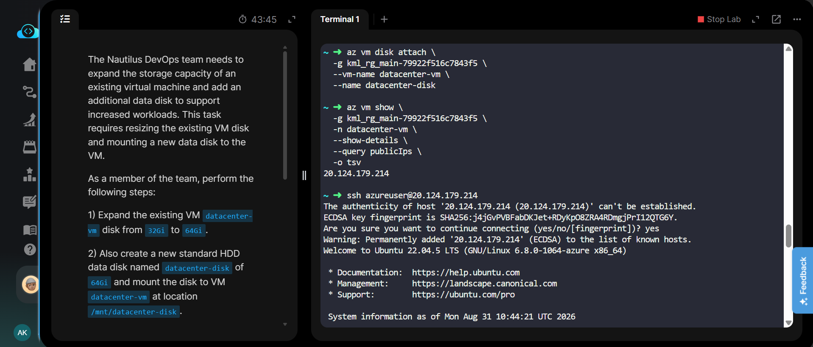
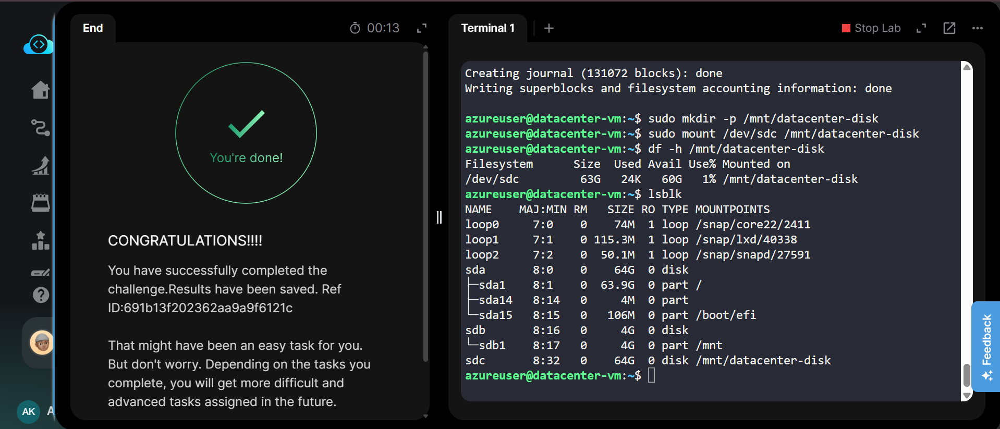

# Task 25 — Expand VM Disk and Mount Data Disk

[](https://azure.microsoft.com/)
[](https://learn.microsoft.com/cli/azure/)
[](https://ubuntu.com/)

---

## Project Information

| Field | Details |
|---|---|
| **Project Name** | Expand VM OS Disk and Mount Data Disk |
| **Task Number** | 25 |
| **Cloud Platform** | Microsoft Azure |
| **Category** | Storage / Virtual Machine |
| **Primary Services** | Azure Virtual Machine, Managed Disk |
| **VM Name** | `datacenter-vm` |
| **Data Disk Name** | `datacenter-disk` |
| **OS Disk** | Expanded from `32 GiB` to `64 GiB` |
| **Data Disk Size** | `64 GiB` |
| **Data Disk Type** | Standard HDD (`Standard_LRS`) |
| **Mount Point** | `/mnt/datacenter-disk` |
| **OS** | Ubuntu 22.04 LTS |
| **Region** | East US |
| **Implementation** | Azure CLI + Linux CLI |
| **Status** | Completed Successfully |

---

## Overview

The Nautilus DevOps team required additional storage capacity for the existing Azure Virtual Machine `datacenter-vm`.

The task involved:

1. Expanding the existing OS disk from `32 GiB` to `64 GiB`.
2. Creating a new `64 GiB` Standard HDD managed disk named `datacenter-disk`.
3. Attaching the new managed disk to `datacenter-vm`.
4. Formatting and mounting the disk on Ubuntu at `/mnt/datacenter-disk`.
5. Verifying the mounted disk using Linux storage commands.

---

## Objective

- Increase the OS disk capacity from `32 GiB` to `64 GiB`.
- Create a new `64 GiB` Standard HDD data disk.
- Attach the data disk to `datacenter-vm`.
- Mount the disk at `/mnt/datacenter-disk`.
- Verify that the new storage is available and accessible.

---

## Skills Demonstrated

- Azure Virtual Machine management
- Azure Managed Disk management
- Azure CLI
- VM lifecycle management
- OS disk resizing
- Managed disk creation
- Disk attachment
- Linux block-device management
- Filesystem creation
- Disk mounting
- Storage verification
- SSH connectivity

---

## Services Used

- **Azure Virtual Machine**
- **Azure Managed Disks**
- **Azure CLI**
- **Ubuntu 22.04 LTS**
- **Linux filesystem and mount utilities**

---

## Architecture Diagram



---

## Steps Performed

### 1. Identify the Resource Group

The existing Azure resource group was identified using Azure CLI.

```bash
az group list --query "[].name" --output table | grep kml
```

Resource Group:

```text
kml_rg_main-79922f516c7843f5
```

---

### 2. Identify the Existing OS Disk

The OS disk attached to `datacenter-vm` was identified:

```bash
az vm show \
  -g kml_rg_main-79922f516c7843f5 \
  -n datacenter-vm \
  --query "storageProfile.osDisk.name" \
  -o tsv
```

Output:

```text
datacenter-vm_disk1_363ac023aae44c419f55c165f5891cc6
```

---

### 3. Stop the Virtual Machine

The VM was stopped before resizing the OS disk.

```bash
az vm stop \
  -g kml_rg_main-79922f516c7843f5 \
  -n datacenter-vm
```

---

### 4. Expand the OS Disk

The existing OS disk was expanded from `32 GiB` to `64 GiB`.

```bash
az disk update \
  -g kml_rg_main-79922f516c7843f5 \
  -n datacenter-vm_disk1_363ac023aae44c419f55c165f5891cc6 \
  --size-gb 64
```

The disk update completed successfully.

---

### 5. Start the Virtual Machine

After resizing the OS disk, the VM was started again.

```bash
az vm start \
  -g kml_rg_main-79922f516c7843f5 \
  -n datacenter-vm
```

---

### 6. Create the New Data Disk

A new `64 GiB` Standard HDD managed disk named `datacenter-disk` was created.

```bash
az disk create \
  -g kml_rg_main-79922f516c7843f5 \
  -n datacenter-disk \
  --size-gb 64 \
  --sku Standard_LRS
```

---

### 7. Attach the Data Disk to the VM

The newly created managed disk was attached to `datacenter-vm`.

```bash
az vm disk attach \
  -g kml_rg_main-79922f516c7843f5 \
  --vm-name datacenter-vm \
  --name datacenter-disk
```

---

### 8. Get the VM Public IP

The public IP address was retrieved for SSH access.

```bash
az vm show \
  -g kml_rg_main-79922f516c7843f5 \
  -n datacenter-vm \
  --show-details \
  --query publicIps \
  -o tsv
```

---

### 9. Connect to the VM Using SSH

SSH access to the VM was established using the `azureuser` account.

```bash
ssh azureuser@<PUBLIC-IP>
```

---

### 10. Verify the New Disk

The attached disk was checked using `lsblk`.

```bash
lsblk
```

The new disk appeared as:

```text
sdc       8:32   0    64G  0 disk
```

---

### 11. Create Filesystem

The new disk was formatted with the `ext4` filesystem.

```bash
sudo mkfs.ext4 /dev/sdc
```

---

### 12. Create Mount Directory

The required mount directory was created:

```bash
sudo mkdir -p /mnt/datacenter-disk
```

---

### 13. Mount the Data Disk

The new disk was mounted at the required location:

```bash
sudo mount /dev/sdc /mnt/datacenter-disk
```

---

### 14. Verify the Mount

The mounted filesystem was verified using:

```bash
df -h /mnt/datacenter-disk
```

Output:

```text
Filesystem      Size  Used Avail Use% Mounted on
/dev/sdc         63G   24K   60G   1% /mnt/datacenter-disk
```

The final `lsblk` verification showed:

```text
sdc       8:32   0    64G  0 disk /mnt/datacenter-disk
```

This confirms that the new `64 GiB` disk was successfully attached and mounted.

---

## Commands Used

All Azure CLI, SSH, and Linux storage commands used in this task are documented separately.

[View Commands →](Commands/commands.md)

---

## Troubleshooting

### Issue: OS Disk Resize Failed While VM Was Running

The first disk resize attempt returned:

```text
(OperationNotAllowed) Change in disk property of OS disk is not allowed when VM is running.
```

**Solution:** Stop the VM before resizing the OS disk.

```bash
az vm stop \
  -g kml_rg_main-79922f516c7843f5 \
  -n datacenter-vm
```

Then resize the disk:

```bash
az disk update \
  -g kml_rg_main-79922f516c7843f5 \
  -n datacenter-vm_disk1_363ac023aae44c419f55c165f5891cc6 \
  --size-gb 64
```

After resizing, start the VM again.

---

### Issue: New Disk Not Mounted Automatically

After attaching the managed disk, it appeared as a block device but was not mounted automatically.

**Solution:**

```bash
sudo mkfs.ext4 /dev/sdc
sudo mkdir -p /mnt/datacenter-disk
sudo mount /dev/sdc /mnt/datacenter-disk
```

---

## Debugging Notes

- The OS disk could not be resized while the VM was running.
- The VM was stopped before changing the OS disk size.
- The OS disk was successfully increased to `64 GiB`.
- The new managed disk appeared as `/dev/sdc`.
- The new disk was formatted using `ext4`.
- The disk was successfully mounted at `/mnt/datacenter-disk`.
- `lsblk` and `df -h` confirmed the final storage configuration.

---

## Best Practices

- Stop the VM before resizing an attached OS disk when Azure requires it.
- Verify the disk name before modifying an existing disk.
- Use descriptive managed disk names such as `datacenter-disk`.
- Verify the device name with `lsblk` before formatting a disk.
- Always verify the mount point after mounting a new disk.
- Avoid formatting a disk until its device identity has been confirmed.
- Use separate managed disks for additional application or workload storage.

---

## Key Learnings

- Azure Managed Disks can be resized using Azure CLI.
- An attached OS disk may require the VM to be stopped before resizing.
- Azure Managed Disks can be created independently and attached to existing VMs.
- Linux detects attached Azure disks as block devices such as `/dev/sdc`.
- A new disk must have a filesystem before normal file storage can be used.
- Linux `mount` connects a filesystem to a directory.
- `lsblk` and `df -h` are useful commands for verifying disk and mount configuration.

---

## Related Concepts

- Azure Managed Disks
- Azure Virtual Machines
- OS Disk vs Data Disk
- Standard HDD
- Standard_LRS
- Linux Block Devices
- ext4 Filesystem
- Linux Mount Points
- Azure CLI
- VM Storage Management

---

## Screenshots

### 01 — Resize OS Disk

Shows the successful OS disk resize operation from `32 GiB` to `64 GiB`.

<a href="screenshots/01-resize-os-disk.png">
  
</a>

---

### 02 — Create Data Disk

Shows the creation of the `datacenter-disk` managed disk with `64 GiB` capacity and Standard HDD storage.

<a href="screenshots/02-create-data-disk.png">
  
</a>

---

### 03 — Attach Disk and SSH

Shows the data disk attachment and successful SSH connection to `datacenter-vm`.

<a href="screenshots/03-attach-disk-and-ssh.png">
  
</a>

---

### 04 — Mount and Verify

Shows the filesystem creation, mounting of `/dev/sdc`, and final verification using `df -h` and `lsblk`.

<a href="screenshots/04-mount-and-verify.png">
  
</a>

---

## Result

**Task completed successfully.**

- ✅ Existing OS disk expanded from **32 GiB → 64 GiB**
- ✅ Created **64 GiB Standard HDD** managed disk
- ✅ Disk named **`datacenter-disk`**
- ✅ Attached disk to **`datacenter-vm`**
- ✅ Formatted disk with **ext4**
- ✅ Mounted at **`/mnt/datacenter-disk`**
- ✅ Verified using `lsblk` and `df -h`
- ✅ Azure lab validation passed successfully