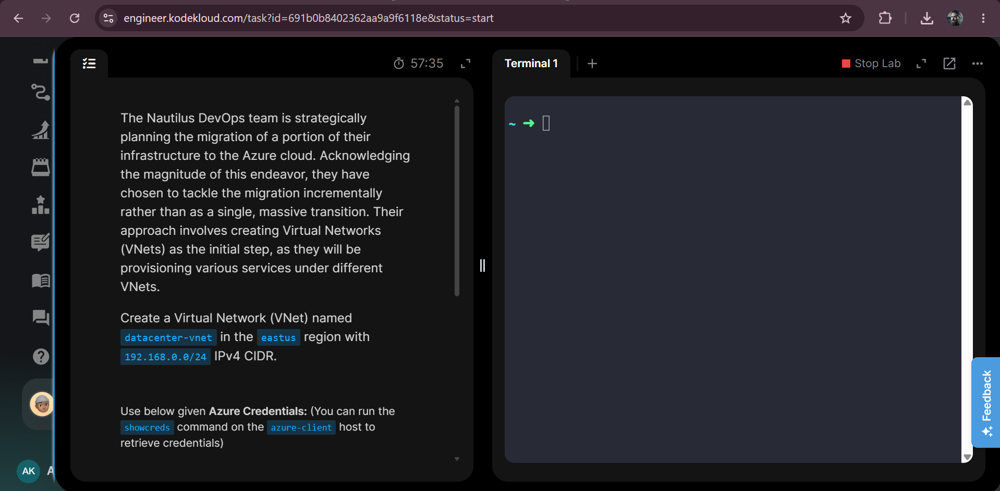
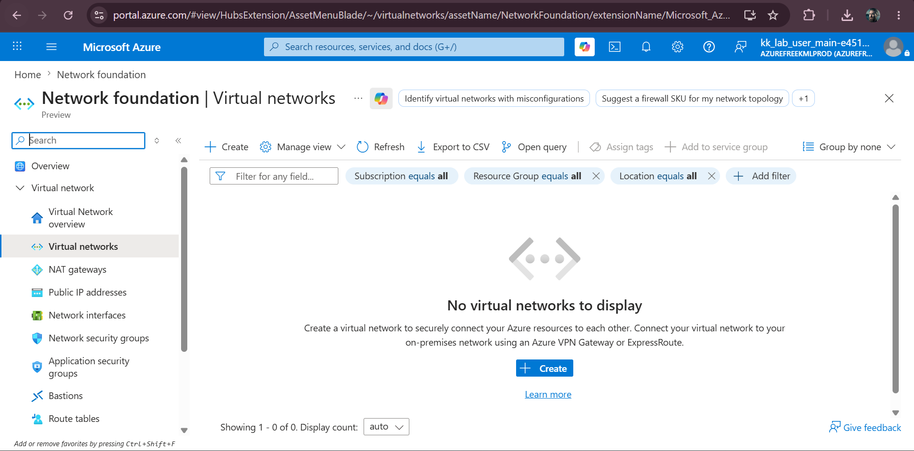
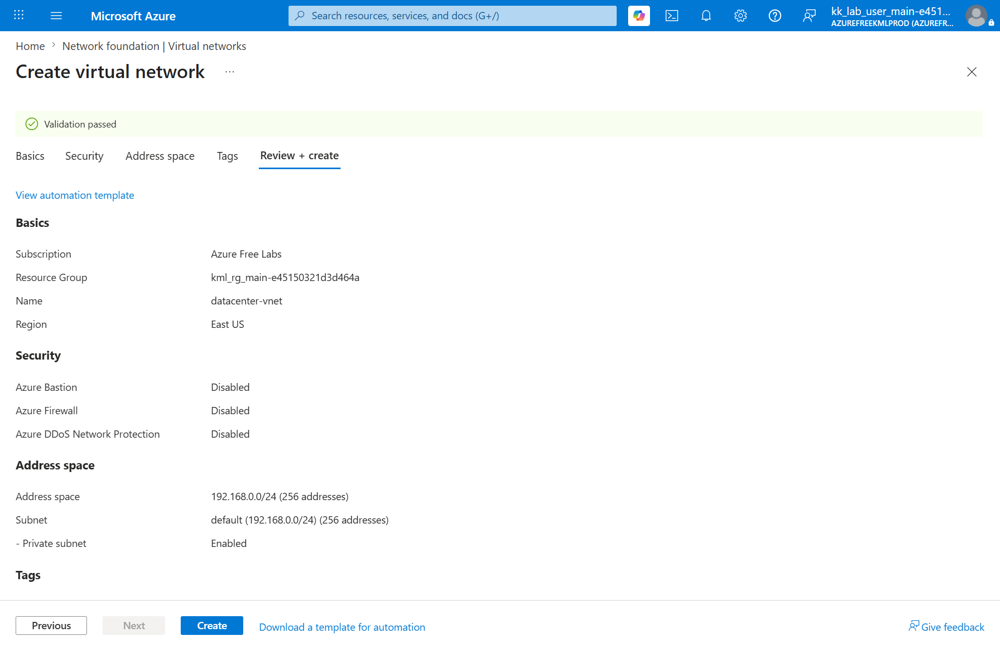
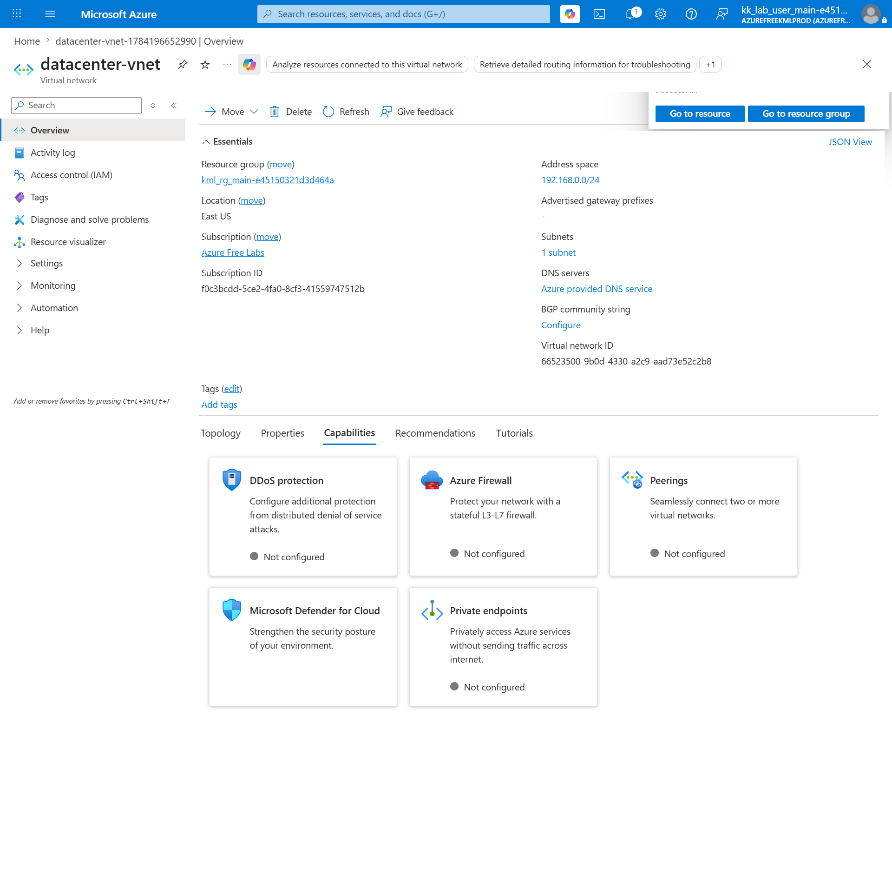
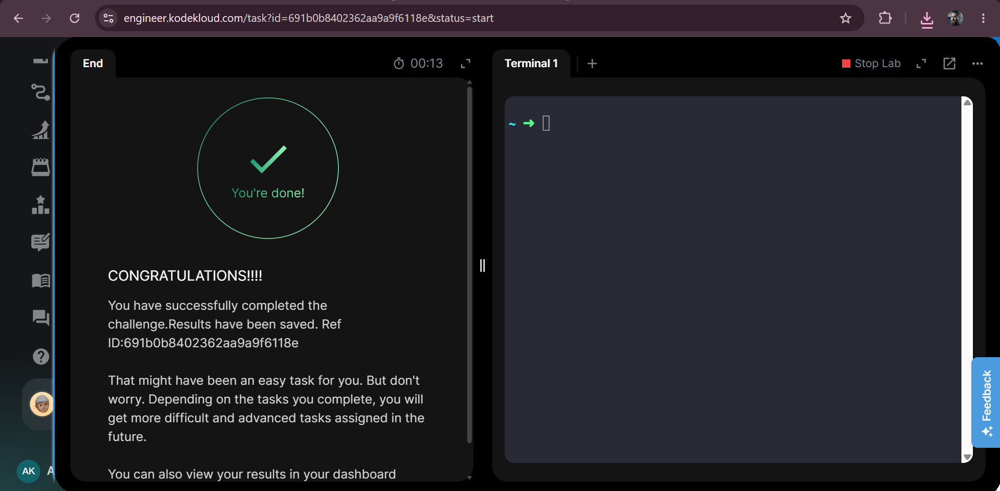

# 🌐 Azure Virtual Network - Create VNet with Custom IPv4 CIDR


---

# 📖 Overview

This lab demonstrates how to create an Azure Virtual Network (VNet) with a custom IPv4 CIDR block. A Virtual Network provides secure communication between Azure resources and is one of the fundamental networking services in Microsoft Azure.

---

# 🎯 Objective

Create an Azure Virtual Network with the following configuration:

- **Virtual Network Name:** `datacenter-vnet`
- **Region:** `East US`
- **IPv4 CIDR:** `192.168.0.0/24`

---

# ☁️ Azure Services Used

- Azure Virtual Network (VNet)
- Azure Resource Group

---

# 🏗️ Architecture Diagram

> **Not Applicable** (Simple VNet creation task)

---

# 🛠️ Steps Performed

1. Logged into the Azure Portal.
2. Opened **Virtual Networks**.
3. Clicked **Create**.
4. Selected the Resource Group.
5. Entered the VNet name:
   - `datacenter-vnet`
6. Selected the Region:
   - `East US`
7. Configured the IPv4 Address Space:
   - `192.168.0.0/24`
8. Reviewed all settings.
9. Clicked **Create**.
10. Verified that the Virtual Network was successfully created.

---

# ✅ Result

Successfully created an Azure Virtual Network named **datacenter-vnet** in the **East US** region with the **192.168.0.0/24** IPv4 CIDR block.

---

# 📚 Key Learnings

- Learned how to create an Azure Virtual Network.
- Understood the purpose of IPv4 CIDR blocks.
- Learned how Azure automatically creates a default subnet.
- Practiced configuring networking resources using the Azure Portal.

---

# 💻 Commands

### Azure CLI (Equivalent)

```bash
az network vnet create \
  --resource-group <RESOURCE_GROUP_NAME> \
  --name datacenter-vnet \
  --location eastus \
  --address-prefixes 192.168.0.0/24
```

---

# 🛠️ Troubleshooting

| Issue | Solution |
|--------|----------|
| Invalid CIDR block | Verify the CIDR notation is correct. |
| Resource name already exists | Choose a unique Virtual Network name. |
| Wrong region selected | Ensure the VNet is created in **East US**. |
| Deployment failed | Verify the selected Resource Group and subscription. |

---

# 📸 Clickable Screenshots Gallery

| Screenshot | Preview |
|------------|---------|
| Task Description | [](screenshots/01-task.png) |
| Virtual Networks Overview | [](screenshots/02-vnet-overview.png) |
| Review & Create | [](screenshots/03-review-create.png) |
| Virtual Network Created | [](screenshots/04-vnet-created.png) |
| Task Completed | [](screenshots/05-task-completed.png) |

---

## 👨‍💻 Author

**Aman Khadia**

Learning and documenting Azure hands-on labs through KodeKloud to strengthen practical cloud networking skills.