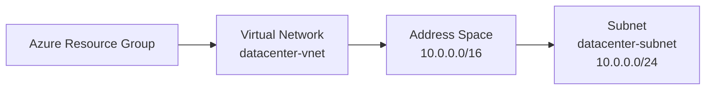
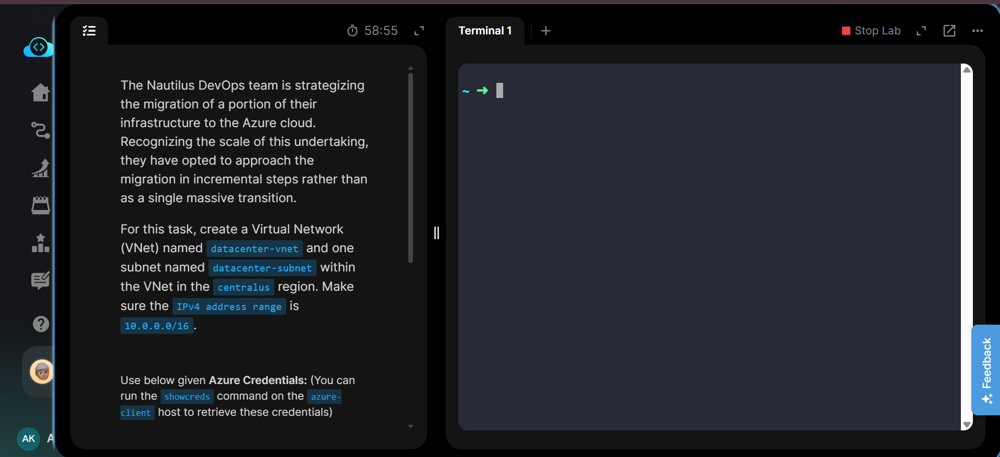
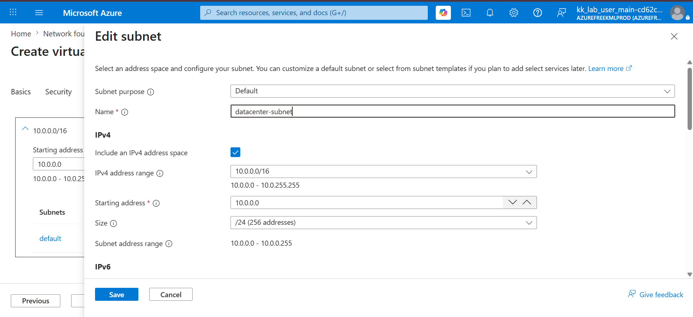
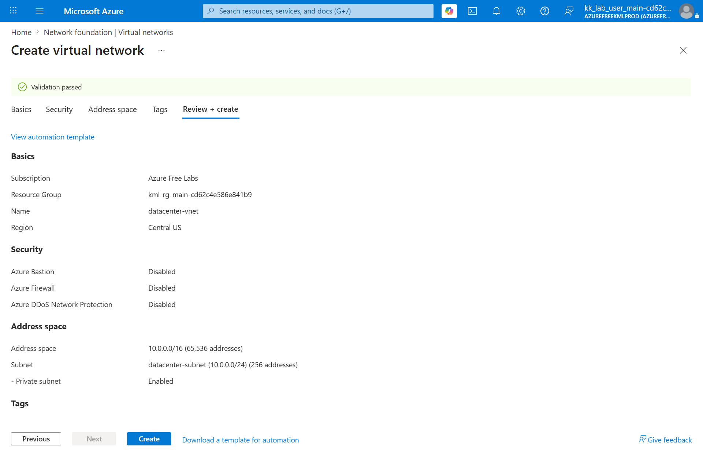
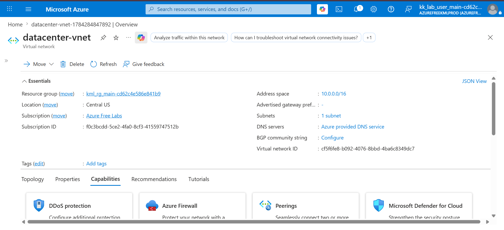
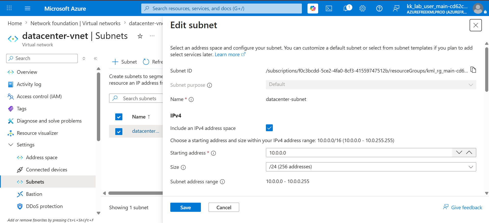
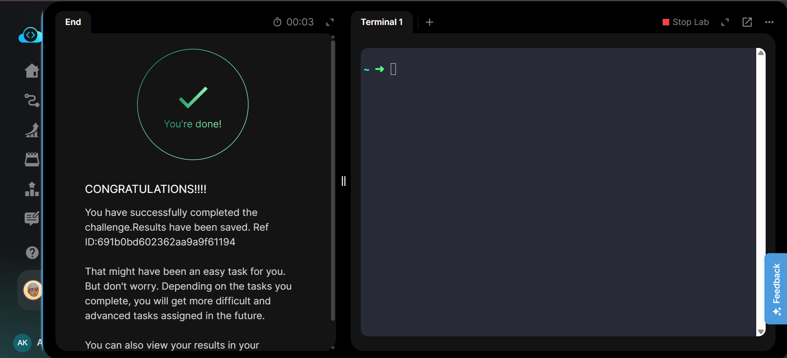

# 🏷️ Badges

---

# 📋 Project Information

| Property | Value |
|----------|-------|
| **Project Name** | Create Azure Virtual Network with Subnet |
| **Task Number** | 06 |
| **Cloud Platform** | Azure |
| **Category** | Networking |
| **Primary Services** | Azure Virtual Network, Subnet |
| **Difficulty** | Beginner |
| **Region** | Central US |
| **Implementation** | Azure Portal |
| **Completion Status** | ✅ Completed |

---

# 📖 Overview

This project demonstrates how to create an Azure Virtual Network (VNet) with a custom IPv4 address space and configure a subnet within it using the Azure Portal.

Virtual Networks are the foundation of Azure networking, enabling secure communication between Azure resources while providing complete control over IP addressing and network segmentation. In this lab, a VNet named **datacenter-vnet** was created in the **Central US** region with a subnet named **datacenter-subnet**.

---

# 🎯 Objective

- Create an Azure Virtual Network.
- Configure the VNet in the Central US region.
- Assign the IPv4 address space **10.0.0.0/16**.
- Create a subnet named **datacenter-subnet**.
- Verify successful deployment.

---

# 🚀 Skills Demonstrated

- Azure Virtual Network (VNet)
- Azure Subnet Configuration
- Azure Networking
- IPv4 Address Planning
- Resource Deployment
- Azure Portal Navigation

---

# ☁️ Services Used

- Azure Virtual Network
- Azure Subnet
- Azure Resource Group

---

# 🏗️ Architecture Diagram

---

# 📝 Implementation Steps

1. Logged in to the Azure Portal.
2. Opened **Virtual Networks**.
3. Clicked **Create**.
4. Entered the VNet name **datacenter-vnet**.
5. Selected the **Central US** region.
6. Configured the IPv4 address space as **10.0.0.0/16**.
7. Created the subnet **datacenter-subnet**.
8. Reviewed the configuration.
9. Created the Virtual Network.
10. Verified the VNet and subnet after deployment.

---

# 💻 Commands Used

See:

**Commands/commands.md**

---

# ⚠️ Troubleshooting

No issues were encountered during implementation.

---

# 📚 Key Learnings

- Learned how Azure Virtual Networks are created.
- Understood IPv4 address space configuration.
- Learned subnet creation within a VNet.
- Practiced Azure Portal networking configuration.
- Learned Azure networking hierarchy.
- Verified deployed networking resources.
- Understood default subnet sizing.
- Improved Azure networking fundamentals.

---

# 🔗 Related Concepts

- Azure Virtual Network
- Azure Subnet
- Azure Resource Groups
- Azure NSG
- Azure Virtual Machines
- Azure Load Balancer

---

# 📸 Screenshots

## 01. Task

---

## 02. Configure Subnet

---

## 03. Review & Create

---

## 04. VNet Overview

---

## 05. Subnet Overview

---

## 06. Task Completed

---

# ✅ Result

The Azure Virtual Network **datacenter-vnet** was successfully deployed in the **Central US** region with the IPv4 address space **10.0.0.0/16**. A subnet named **datacenter-subnet** was created and verified successfully.

This implementation demonstrates the basic networking setup required before deploying Azure resources such as Virtual Machines, Load Balancers, and other cloud services.
