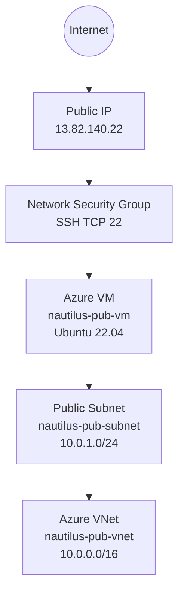
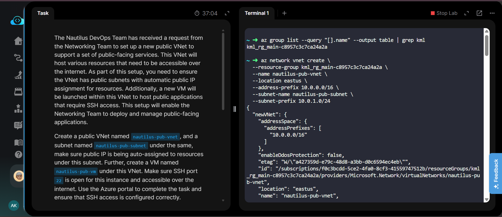
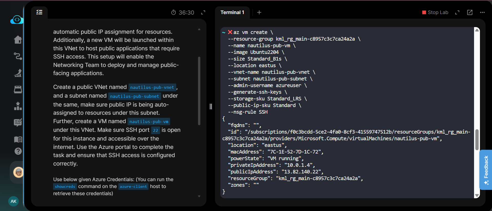
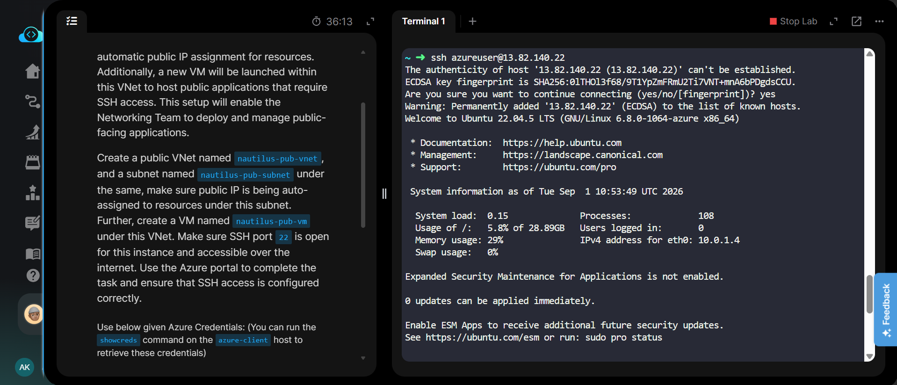
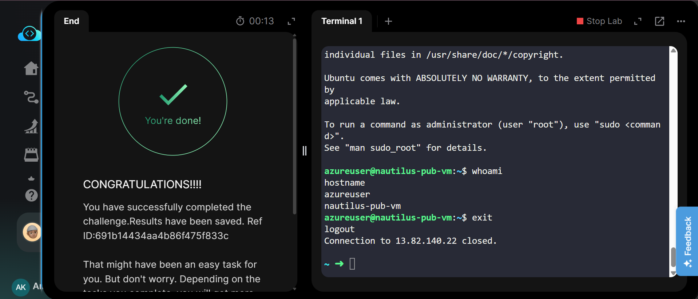

# Azure Public VNet with Public Subnet and VM

[](https://azure.microsoft.com/)
[](https://azure.microsoft.com/products/virtual-machines)
[](https://ubuntu.com/)
[](https://github.com/aman-khadia/cloud-labs)

---

## Project Information

| Field | Details |
|---|---|
| **Project Name** | Create Public VNet with Public Subnet and VM |
| **Task Number** | Task 26 |
| **Cloud Platform** | Microsoft Azure |
| **Category** | Networking / Virtual Network |
| **Primary Services** | Azure Virtual Network, Subnet, Virtual Machine, Public IP, Network Security Group |
| **VNet Name** | `nautilus-pub-vnet` |
| **Subnet Name** | `nautilus-pub-subnet` |
| **VM Name** | `nautilus-pub-vm` |
| **Region** | East US |
| **Address Space** | `10.0.0.0/16` |
| **Subnet Prefix** | `10.0.1.0/24` |
| **VM Size** | `Standard_B1s` |
| **OS Image** | Ubuntu 22.04 |
| **Admin Username** | `azureuser` |
| **SSH Port** | `22` |
| **Public IP** | `13.82.140.22` |
| **Implementation** | Azure CLI |
| **Status** | Completed |

---

## Overview

The Nautilus DevOps Team required a new public Virtual Network to support public-facing applications and services.

The task involved creating a new Azure VNet with a dedicated subnet, configuring public IP assignment for resources, launching a virtual machine inside the subnet, and ensuring SSH access over the internet.

The environment was created in the **East US** region.

---

## Objective

The objectives of this task were:

- Create a public VNet named `nautilus-pub-vnet`.
- Create a subnet named `nautilus-pub-subnet`.
- Configure the subnet for resources requiring public internet access.
- Create a VM named `nautilus-pub-vm`.
- Configure SSH access on port `22`.
- Assign a public IP address to the VM.
- Verify SSH connectivity from the `azure-client` host.
- Confirm successful VM access and configuration.

---

## Skills Demonstrated

- Azure Virtual Network configuration
- Azure subnet creation
- IP address planning
- Azure Virtual Machine deployment
- Public IP configuration
- Network Security Group configuration
- SSH authentication
- Linux VM administration
- Azure CLI
- Cloud networking fundamentals
- Connectivity verification

---

## Services Used

- **Azure Virtual Network**
- **Azure Subnet**
- **Azure Virtual Machine**
- **Azure Public IP**
- **Azure Network Security Group**
- **Azure CLI**
- **Ubuntu 22.04**

---

## Architecture Diagram



---

## Steps Performed

### 1. Identified the Resource Group

The lab resource group was identified using Azure CLI.

```bash
az group list --query "[].name" --output table | grep kml
```

Resource group used:

```text
kml_rg_main-c8957c3c7ca24a2a
```

---

### 2. Created the Public VNet and Subnet

Created the VNet `nautilus-pub-vnet` with the address space `10.0.0.0/16`.

The subnet `nautilus-pub-subnet` was created with the address range `10.0.1.0/24`.

```bash
az network vnet create \
  --resource-group kml_rg_main-c8957c3c7ca24a2a \
  --name nautilus-pub-vnet \
  --location eastus \
  --address-prefix 10.0.0.0/16 \
  --subnet-name nautilus-pub-subnet \
  --subnet-prefix 10.0.1.0/24
```

---

### 3. Created the Azure VM

The VM `nautilus-pub-vm` was created inside the public subnet.

The VM uses:

- Ubuntu 22.04
- `Standard_B1s`
- `Standard_LRS`
- SSH authentication
- Standard Public IP
- SSH NSG rule

```bash
az vm create \
  --resource-group kml_rg_main-c8957c3c7ca24a2a \
  --name nautilus-pub-vm \
  --image Ubuntu2204 \
  --size Standard_B1s \
  --location eastus \
  --vnet-name nautilus-pub-vnet \
  --subnet nautilus-pub-subnet \
  --admin-username azureuser \
  --generate-ssh-keys \
  --storage-sku Standard_LRS \
  --public-ip-sku Standard \
  --nsg-rule SSH
```

The VM was successfully created with:

```text
VM Name:       nautilus-pub-vm
Location:      eastus
Private IP:    10.0.1.4
Public IP:     13.82.140.22
Power State:   VM running
```

---

### 4. Verified Public IP Assignment

The VM received a public IP address:

```text
13.82.140.22
```

This confirms that the VM is reachable through a public IP and can be accessed from the internet when the corresponding NSG rule allows the traffic.

---

### 5. Configured SSH Access

The VM was created with the SSH NSG rule enabled:

```bash
--nsg-rule SSH
```

This allows inbound SSH traffic over TCP port `22`.

---

### 6. Tested SSH Connectivity

SSH connectivity was tested using:

```bash
ssh azureuser@13.82.140.22
```

The SSH connection was successfully established.

---

### 7. Verified the Logged-in User

After connecting to the VM:

```bash
whoami
```

Output:

```text
azureuser
```

---

### 8. Verified the VM Hostname

```bash
hostname
```

Output:

```text
nautilus-pub-vm
```

These checks confirmed that the SSH session was connected to the correct VM.

---

### 9. Exited the SSH Session

```bash
exit
```

The SSH connection was closed successfully.

---

## Commands Used

All Azure CLI, SSH, and verification commands used during this lab are documented separately:

**[View Commands →](Commands/commands.md)**

---

## Troubleshooting

### Issue: VM creation failed because of disk policy

The initial VM creation attempt failed with:

```text
RequestDisallowedByPolicy
```

The Azure policy required the compute disk to use an allowed storage configuration.

The VM creation command was corrected by explicitly specifying:

```bash
--storage-sku Standard_LRS
```

The VM was then created successfully.

### Issue Resolution

Corrected command:

```bash
az vm create \
  --resource-group kml_rg_main-c8957c3c7ca24a2a \
  --name nautilus-pub-vm \
  --image Ubuntu2204 \
  --size Standard_B1s \
  --location eastus \
  --vnet-name nautilus-pub-vnet \
  --subnet nautilus-pub-subnet \
  --admin-username azureuser \
  --generate-ssh-keys \
  --storage-sku Standard_LRS \
  --public-ip-sku Standard \
  --nsg-rule SSH
```

The corrected deployment completed successfully.

---

## Debugging Notes

- The required region was **East US**, so all resources were created in `eastus`.
- The VNet address space was configured as `10.0.0.0/16`.
- The public subnet uses `10.0.1.0/24`.
- The VM received private IP `10.0.1.4`.
- The VM received public IP `13.82.140.22`.
- SSH access was enabled using the `SSH` NSG rule.
- The VM was successfully accessed using SSH.
- `whoami` confirmed the `azureuser` account.
- `hostname` confirmed the VM name `nautilus-pub-vm`.

---

## Best Practices

- Use separate subnets for different application tiers.
- Restrict NSG inbound rules to only the required ports.
- Use SSH keys instead of password-based authentication.
- Avoid exposing unnecessary services directly to the internet.
- Use appropriate CIDR ranges when designing VNet and subnet address spaces.
- Use Standard storage SKUs where required by organizational policies.
- Verify both private and public connectivity after deployment.
- Use Azure NSGs to control inbound and outbound network traffic.

---

## Key Learnings

- A VNet provides the networking foundation for Azure resources.
- Subnets divide a VNet into logical network segments.
- Public IP addresses allow Azure resources to be reachable from the internet.
- Network Security Groups control network traffic to Azure resources.
- SSH uses TCP port `22`.
- Azure VMs can be deployed directly into a specific VNet and subnet.
- Azure CLI can be used to automate VNet, subnet, VM, public IP, and NSG configuration.
- Storage SKU selection can be affected by Azure Policy restrictions.
- Successful SSH access verifies that the public IP, NSG rule, VM networking, and SSH configuration are working together correctly.

---

## Related Concepts

- Azure Virtual Network
- Azure Subnet
- CIDR
- Private IP Address
- Public IP Address
- Network Security Group
- Inbound Rules
- SSH
- Azure Virtual Machines
- Azure CLI
- Cloud Networking
- Network Security

---

## Screenshots

### 01 - VNet and Subnet Creation



---

### 02 - VM Creation



---

### 03 - SSH Connection



---

### 04 - Task Completed



---

## Result

The public Azure networking environment was successfully configured.

The following resources were created:

```text
VNet
└── nautilus-pub-vnet
    └── nautilus-pub-subnet
        └── nautilus-pub-vm
```

Final configuration:

```text
VNet:          nautilus-pub-vnet
Subnet:        nautilus-pub-subnet
VM:            nautilus-pub-vm
Region:        East US
Private IP:    10.0.1.4
Public IP:     13.82.140.22
SSH Port:      22
OS:            Ubuntu 22.04
Status:        VM running
```

SSH connectivity was successfully verified using:

```bash
whoami
hostname
```

Expected output:

```text
azureuser
nautilus-pub-vm
```

The lab was successfully completed and the required public VNet, subnet, VM, public IP connectivity, and SSH access were verified.